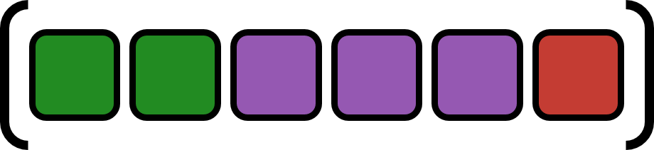

# ComponentArrays.jl


| **Documentation**                                                               | **Build Status**                                                                                |
|:-------------------------------------------------------------------------------:|:-----------------------------------------------------------------------------------------------:|
| [![][docs-stable-img]][docs-stable-url] [![][docs-dev-img]][docs-dev-url] | [![][build-img]][build-url] [![][codecov-img]][codecov-url] |


[docs-dev-img]: https://img.shields.io/badge/docs-latest-blue.svg
[docs-dev-url]: https://jonniedie.github.io/ComponentArrays.jl/dev

[docs-stable-img]: https://img.shields.io/badge/docs-stable-blue.svg
[docs-stable-url]: https://jonniedie.github.io/ComponentArrays.jl/stable

[build-img]: https://img.shields.io/github/actions/workflow/status/jonniedie/ComponentArrays.jl/ci.yml
[build-url]: https://github.com/jonniedie/docs/ComponentArrays.jl/workflows/ci.yml

[codecov-img]: https://img.shields.io/codecov/c/github/jonniedie/ComponentArrays.jl
[codecov-url]: https://codecov.io/gh/jonniedie/ComponentArrays.jl

The main export of this package is the ````ComponentArray```` type. "Components" of ````ComponentArray````s
are really just array blocks that can be accessed through a named index. This will create a new ```ComponentArray``` whose data is a view into the original,
allowing for standalone models to be composed together by simple function composition. In
essence, ```ComponentArray```s allow you to do the things you would usually need a modeling
language for, but without actually needing a modeling language. The main targets are for use
in [DifferentialEquations.jl](https://github.com/SciML/DifferentialEquations.jl) and
[Optim.jl](https://github.com/JuliaNLSolvers/Optim.jl), but anything that requires
flat vectors is fair game.

Check out the [NEWS](https://github.com/jonniedie/ComponentArrays.jl/blob/master/NEWS.md) for new features by minor release version.


## General use
The easiest way to construct 1-dimensional ```ComponentArray```s (aliased as `ComponentVector`) is as if they were ```NamedTuple```s. In fact, a good way to think about them is as arbitrarily nested, mutable ```NamedTuple```s that can be passed through a solver.
```julia
julia> c = (a=2, b=[1, 2]);

julia> x = ComponentArray(a=5, b=[(a=20., b=0), (a=33., b=0), (a=44., b=3)], c=c)
ComponentVector{Float64}(a = 5.0, b = [(a = 20.0, b = 0.0), (a = 33.0, b = 0.0), (a = 44.0, b = 3.0)], c = (a = 2.0, b = [1.0, 2.0]))

julia> x.c.a = 400; x
ComponentVector{Float64}(a = 5.0, b = [(a = 20.0, b = 0.0), (a = 33.0, b = 0.0), (a = 44.0, b = 3.0)], c = (a = 400.0, b = [1.0, 2.0]))

julia> x[8]
400.0

julia> collect(x)
10-element Array{Float64,1}:
   5.0
  20.0
   0.0
  33.0
   0.0
  44.0
   3.0
 400.0
   1.0
   2.0

julia> typeof(similar(x, Int32)) === typeof(ComponentVector{Int32}(a=5, b=[(a=20., b=0), (a=33., b=0), (a=44., b=3)], c=c))
true
```
`ComponentArray`s can be constructed from existing
`ComponentArray`s (currently nested fields cannot be changed this way):
```julia
julia> x = ComponentVector(a=1, b=2, c=3);

julia> ComponentVector(x; a=11, new=42)
ComponentVector{Int64}(a = 11, b = 2, c = 3, new = 42)
```

Higher dimensional ```ComponentArray```s can be created too, but it's a little messy at the moment. The nice thing for modeling is that dimension expansion through broadcasted operations can create higher-dimensional ```ComponentArray```s automatically, so Jacobian cache arrays that are created internally with ```false .* x .* x'``` will be two-dimensional ```ComponentArray```s (aliased as `ComponentMatrix`) with proper axes. Check out the [ODE with Jacobian](https://github.com/jonniedie/ComponentArrays.jl/blob/master/examples/ODE_jac_example.jl) example in the examples folder to see how this looks in practice.
```julia
julia> x = ComponentArray(a=1, b=[2, 1, 4.0], c=c)
ComponentVector{Float64}(a = 1.0, b = [2.0, 1.0, 4.0], c = (a = 2.0, b = [1.0, 2.0]))

julia> x2 = x .* x'
7×7 ComponentMatrix{Float64} with axes Axis(a = 1, b = 2:4, c = ViewAxis(5:7, Axis(a = 1, b = 2:3))) × Axis(a = 1, b = 2:4, c = ViewAxis(5:7, Axis(a = 1, b = 2:3)))
 1.0  2.0  1.0   4.0  2.0  1.0  2.0
 2.0  4.0  2.0   8.0  4.0  2.0  4.0
 1.0  2.0  1.0   4.0  2.0  1.0  2.0
 4.0  8.0  4.0  16.0  8.0  4.0  8.0
 2.0  4.0  2.0   8.0  4.0  2.0  4.0
 1.0  2.0  1.0   4.0  2.0  1.0  2.0
 2.0  4.0  2.0   8.0  4.0  2.0  4.0

julia> x2[:c,:c]
3×3 ComponentMatrix{Float64} with axes Axis(a = 1, b = 2:3) × Axis(a = 1, b = 2:3)
 4.0  2.0  4.0
 2.0  1.0  2.0
 4.0  2.0  4.0

julia> x2[:a,:a]
 1.0

julia> @view x2[:a,:c]
ComponentVector{Float64,SubArray...}(a = 2.0, b = [1.0, 2.0])

julia> x2[:b,:c]
3×3 ComponentMatrix{Float64} with axes FlatAxis() × Axis(a = 1, b = 2:3)
 4.0  2.0  4.0
 2.0  1.0  2.0
 8.0  4.0  8.0
```


## Examples
### Differential equation example
This example uses ```@unpack``` from [Parameters.jl](https://github.com/mauro3/Parameters.jl)
for nice syntax. Example taken from:
https://github.com/JuliaDiffEq/ModelingToolkit.jl/issues/36#issuecomment-536221300
```julia
using ComponentArrays
using DifferentialEquations
using Parameters: @unpack


tspan = (0.0, 20.0)


## Lorenz system
function lorenz!(D, u, p, t; f=0.0)
    @unpack σ, ρ, β = p
    @unpack x, y, z = u

    D.x = σ*(y - x)
    D.y = x*(ρ - z) - y - f
    D.z = x*y - β*z
    return nothing
end

lorenz_p = (σ=10.0, ρ=28.0, β=8/3)
lorenz_ic = ComponentArray(x=0.0, y=0.0, z=0.0)
lorenz_prob = ODEProblem(lorenz!, lorenz_ic, tspan, lorenz_p)


## Lotka-Volterra system
function lotka!(D, u, p, t; f=0.0)
    @unpack α, β, γ, δ = p
    @unpack x, y = u

    D.x =  α*x - β*x*y + f
    D.y = -γ*y + δ*x*y
    return nothing
end

lotka_p = (α=2/3, β=4/3, γ=1.0, δ=1.0)
lotka_ic = ComponentArray(x=1.0, y=1.0)
lotka_prob = ODEProblem(lotka!, lotka_ic, tspan, lotka_p)


## Composed Lorenz and Lotka-Volterra system
function composed!(D, u, p, t)
    c = p.c #coupling parameter
    @unpack lorenz, lotka = u

    lorenz!(D.lorenz, lorenz, p.lorenz, t, f=c*lotka.x)
    lotka!(D.lotka, lotka, p.lotka, t, f=c*lorenz.x)
    return nothing
end

comp_p = (lorenz=lorenz_p, lotka=lotka_p, c=0.01)
comp_ic = ComponentArray(lorenz=lorenz_ic, lotka=lotka_ic)
comp_prob = ODEProblem(composed!, comp_ic, tspan, comp_p)


## Solve problem
# We can solve the composed system...
comp_sol = solve(comp_prob)

# ...or we can unit test one of the component systems
lotka_sol = solve(lotka_prob)
```

Notice how cleanly the ```composed!``` function can pass variables from one function to another with no array index juggling in sight. This is especially useful for large models as it becomes harder to keep track top-level model array position when adding new or deleting old components from the model. We could go further and compose ```composed!``` with other components ad (practically) infinitum with no mental bookkeeping.

The main benefit, however, is now our differential equations are unit testable. Both ```lorenz``` and ```lotka``` can be run as their own ```ODEProblem``` with ```f``` set to zero to see the unforced response.
